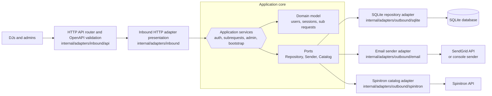

# Air Cover

Air Cover is a Spinitron integration that allows DJs (Personas) to request substitutes to cover their shows, and in turn, allows them to pick up other substitution requests.

## Architecture

Air Cover uses a hexagonal architecture. The application core owns use cases,
domain behavior, read models, and ports; adapters translate between that core and
external protocols or services.

### Hexagonal Diagram

### File organization

This project is built using Go. Most application code lives under `internal/`,
with directories named by architectural role and dependency direction:

- `cmd/aircover/`: Contains the main application entry point.
- `internal/cmd/`: Composition root for commands, configuration, adapter wiring, and process lifecycle.
- `internal/domain/`: Domain entities and behavior, free of transport, persistence, config, and logging concerns.
- `internal/app/`: Application services, read models, and app-owned ports. Ports stay near the use case that needs them.
- `internal/adapters/inbound/api/`: Inbound HTTP API implementation, including the OpenAPI spec, generated API types, handlers, middleware, and router.
- `internal/adapters/inbound/presenter/`: HTTP-owned view models and presentation mapping.
- `internal/adapters/inbound/ui/`: templ UI for the inbound HTTP adapter.
- `internal/adapters/outbound/sqlite/`: SQLite/libSQL repository adapter, including migrations, sqlc queries, and generated sqlc code.
- `internal/adapters/outbound/email/`: Email sender adapter.
- `internal/adapters/outbound/spinitron/`: Spinitron API and catalog adapter.
- `internal/platform/`: Process-level technical helpers such as config and logging.

### Boundary Rules

- `internal/domain` must not import app, adapter, platform, HTTP, SQL, or serialization concerns.
- `internal/app` may import domain packages, but not concrete adapters or platform packages.
- Inbound adapters may call app use cases, but must not import outbound adapters.
- Outbound adapters may implement app-owned ports, but must not import inbound adapters.
- Concrete adapter wiring belongs in `internal/cmd`.
- Generated code stays inside the adapter that owns the tool or protocol, such as `internal/adapters/outbound/sqlite/dbgen`.
