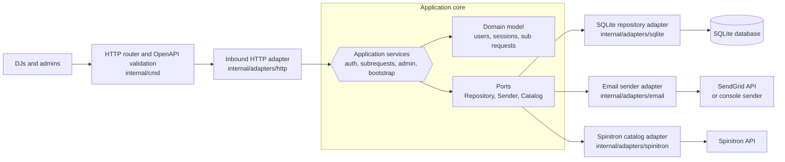

# Air Cover

Air Cover is a Spinitron integration that allows DJs (Personas) to request substitutes to cover their shows, and in turn, allows them to pick up other substitution requests.

## Architecture

### Hexagonal diagam

### File organization

This project is built using Go. The general structure follows standard Go project layouts:

- `cmd/aircover/`: Contains the main application entry point.
- `internal/`: Contains private application code.
  - `internal/domain/`: Domain entities and behavior (users, auth, substitution requests, etc.)
  - `internal/app/`: Application services and ports.
  - `internal/adapters/`: Outbound adapters for SQLite, email, and Spinitron.
  - `internal/adapters/http/`: Handlers for the application's HTTP API.
