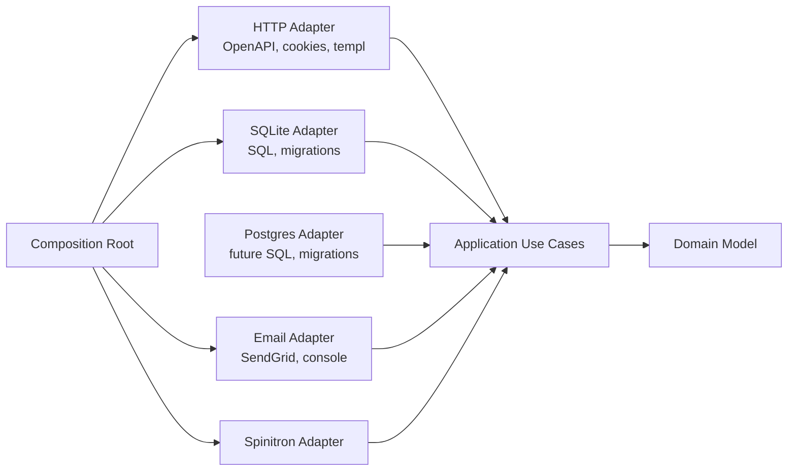

# Hexagonal Architecture Migration Plan

## Idealized State

Air Cover has a small core made of domain types, domain rules, and application use cases. That core does not import HTTP, generated OpenAPI types, SQL/database packages, templ/UI packages, email providers, or Spinitron client implementations.

Target package shape:

- `internal/domain`: entities and value objects such as `User`, `Role`, `Session`, `MagicLink`, `SubRequest`, `SubRequestStatus`, and domain validation/rules that do not need external I/O.
- `internal/app/<feature>`: use cases such as auth, admin users, sub requests, and show catalog orchestration. These own ports like `UserRepository`, `SessionRepository`, `SubRequestRepository`, `MagicLinkRepository`, `EmailSender`, and `ShowCatalog`.
- `internal/adapters/http`: generated OpenAPI wrapper implementation, request parsing, cookies, redirects, status-code mapping, current-user extraction, and view rendering.
- `internal/adapters/sqlite` or `internal/adapters/db/sqlite`: SQLite/libsql repository implementation, SQL queries, migrations, and row-to-domain mapping.
- `internal/adapters/postgres`: future Postgres implementation of the same app-owned ports, with its own migrations and SQL dialect.
- `internal/adapters/email`: SendGrid/console email implementations behind an app-owned sender port.
- `internal/adapters/spinitron`: Spinitron HTTP client/catalog implementation behind an app-owned catalog port.
- `internal/cmd`: composition root that chooses concrete adapters, wires use cases, registers HTTP routes, and owns process lifecycle.

Dependency direction:

In that state, replacing SQLite with Postgres means implementing the repository ports and migration lifecycle in a Postgres adapter, then changing wiring in `[internal/cmd/server.go](/Users/dctalbot/Developer/air-cover/internal/cmd/server.go)`. The domain and use cases do not change.

## Current Gaps To Close

The repository is already partway there: `[internal/app/subrequests/service.go](/Users/dctalbot/Developer/air-cover/internal/app/subrequests/service.go)` and `[internal/app/admin/service.go](/Users/dctalbot/Developer/air-cover/internal/app/admin/service.go)` define local ports and hold meaningful use-case logic.

The main coupling to unwind:

- `[internal/api/handler.go](/Users/dctalbot/Developer/air-cover/internal/api/handler.go)` creates app services and still owns some session lookup, current user, rendering, form parsing, and error mapping.
- `[internal/api/auth.go](/Users/dctalbot/Developer/air-cover/internal/api/auth.go)` mixes HTTP concerns with auth use cases: token creation, magic-link lifecycle, session creation/deletion, cookies, redirects, and middleware.
- `[internal/app/subrequests/service.go](/Users/dctalbot/Developer/air-cover/internal/app/subrequests/service.go)` and `[internal/app/admin/service.go](/Users/dctalbot/Developer/air-cover/internal/app/admin/service.go)` import `[internal/db](/Users/dctalbot/Developer/air-cover/internal/db)` for sentinel errors.
- `[internal/models](/Users/dctalbot/Developer/air-cover/internal/models)` structs are shared as domain, persistence DTOs, JSON DTOs, and view/query DTOs. `SubRequest` already contains enrichment fields like `RequesterEmail`, `TakerEmail`, and `SubstituteID`.
- `[internal/db/repository.go](/Users/dctalbot/Developer/air-cover/internal/db/repository.go)` is a concrete SQLite/libsql adapter but its errors and model types leak upward.
- `[internal/db/db.go](/Users/dctalbot/Developer/air-cover/internal/db/db.go)` and migrations are SQLite/libsql-specific, which is fine for an adapter but should not be assumed by the core.

## Incremental Path

Phase 1: make errors persistence-agnostic.

- Have `[internal/db/repository.go](/Users/dctalbot/Developer/air-cover/internal/db/repository.go)` return `[internal/apperrors](/Users/dctalbot/Developer/air-cover/internal/apperrors/errors.go)` errors for not found and conflict cases, or add a small port-error package owned outside `internal/db`.
- Remove `internal/db` imports from app and API packages.
- Update `[internal/cmd/server.go](/Users/dctalbot/Developer/air-cover/internal/cmd/server.go)` master-user bootstrapping to check the app-level not-found error.
- Keep method names and models unchanged in this phase to minimize blast radius.

Phase 2: move ports inward and stop defining repository interfaces in HTTP.

- Move `serverRepository` and `authRepository` responsibilities out of `[internal/api](/Users/dctalbot/Developer/air-cover/internal/api)` and into use-case packages.
- Prefer use-case-specific ports over one broad repository: auth ports, admin user ports, sub-request ports, session lookup ports.
- Make `[internal/cmd/server.go](/Users/dctalbot/Developer/air-cover/internal/cmd/server.go)` wire concrete repositories into app services, then pass app services into the HTTP adapter.
- Keep `[internal/db.Repository](/Users/dctalbot/Developer/air-cover/internal/db/repository.go)` as the concrete implementation of those ports.

Phase 3: extract auth use cases.

- Create `internal/app/auth` for login request, magic-link verification, logout/session invalidation, and current-session lookup.
- Move token hashing/generation policy, magic-link expiry, session expiry, disabled-user behavior, and email-sending orchestration into the auth app service.
- Leave cookies, redirects, content negotiation, status codes, and HTTP context mutation in the HTTP adapter.
- Make auth middleware ask an app-level session/current-user service for the authenticated user rather than reading directly from the repository.

Phase 4: introduce a real domain package gradually.

- Start with domain types that have clear invariants: `User`, `Role`, `CurrentUser`, `Session`, `MagicLink`, and `SubRequest`.
- Move policy functions in `[internal/policy](/Users/dctalbot/Developer/air-cover/internal/policy)` toward domain/application types instead of shared persistence structs.
- Split view/query shapes from domain entities. For example, use a domain `SubRequest` for behavior and a separate app read model for dashboard rows that include requester/taker emails.
- Keep adapters responsible for mapping database rows and generated API inputs into domain/app inputs.

Phase 5: reorganize adapters without breaking behavior.

- Rename or move `[internal/api](/Users/dctalbot/Developer/air-cover/internal/api)` toward `internal/adapters/http` only after use cases are injected cleanly. Generated `[internal/api/api.gen.go](/Users/dctalbot/Developer/air-cover/internal/api/api.gen.go)` can stay where it is until the package move is worth the churn.
- Split `[internal/db](/Users/dctalbot/Developer/air-cover/internal/db)` into database lifecycle/migrations and repository adapter code, or move it under `internal/adapters/sqlite`.
- Keep `[internal/email](/Users/dctalbot/Developer/air-cover/internal/email)` and `[internal/spinitron](/Users/dctalbot/Developer/air-cover/internal/spinitron)` as adapters, but have them implement ports owned by app packages.

Phase 6: prepare for database replacement.

- Define adapter contract tests around app-owned repository ports: user repository, session repository, magic-link repository, and sub-request repository.
- Make SQLite/libsql pass those tests first.
- Isolate dialect-specific assumptions such as `?` placeholders, `LastInsertId`, `DELETE ... RETURNING`, `ON CONFLICT`, `AUTOINCREMENT`, goose dialect selection, and migration file layout.
- Add a future Postgres adapter by implementing the same ports and running the same contract tests.
- Add config-driven adapter selection only when a second implementation exists.

## Validation Strategy

- After each phase, run focused package tests first, then `make test` because coverage is enforced at `100.0%` excluding generated files.
- Keep generated files untouched except through `make generate` when OpenAPI or templ sources change.
- Add tests at the use-case layer as behavior moves out of handlers so existing HTTP coverage can become thinner over time without losing confidence.
- Add repository contract tests before introducing a second database to prevent the ports from accidentally reflecting SQLite-specific behavior.

## Recommended First Slice

Start with Phase 1 plus a small part of Phase 2: replace `db.ErrNotFound` and `db.ErrConflict` outside the DB adapter with app-level errors, then move repository interface ownership out of `[internal/api](/Users/dctalbot/Developer/air-cover/internal/api)` where it is already clearly use-case-specific. This is low-risk, immediately improves dependency direction, and sets up auth extraction without a large rename or file move.